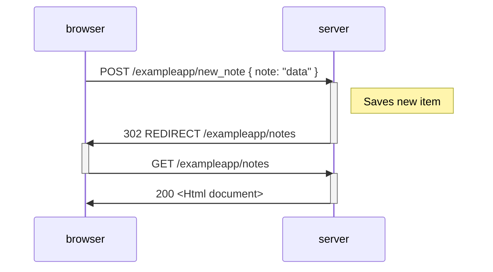

```mermaid
sequenceDiagram
  participant browser
  participant server

  browser->>server: POST /exampleapp/new_note { note: "data" }
  activate server
  Note right of server: Saves new item
  server->>browser: 302 REDIRECT /exampleapp/notes
  deactivate server

  activate browser
  browser->>server: GET /exampleapp/notes
  deactivate browser

  activate server
  server->>browser: 200 <Html document>
  deactivate server
```
